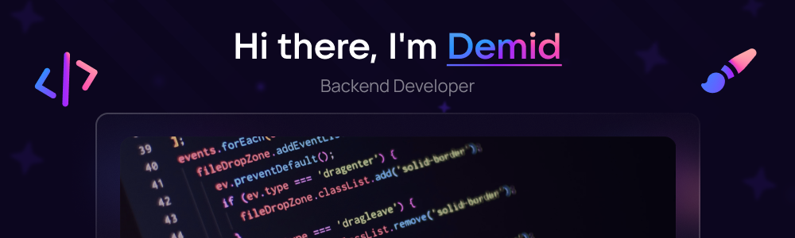

  

  

  

### :woman_technologist: Обо мне :
- :telescope: Мне 17 лет, я студент из России.

- :seedling: Изучаю математику и программирование, совмещаю это в своих проектах.

- :zap: В свободное время я решаю задачи и читаю/пишу технические статьи.

- :mailbox:Как со мной связаться: 

### :hammer_and_wrench: Languages and Tools :

  &nbsp;
  &nbsp;
  &nbsp;
  &nbsp;
  &nbsp;
  &nbsp;
  &nbsp;
  &nbsp;
  &nbsp;
  &nbsp;
  &nbsp;
  

### :fire: Моя статистика :

